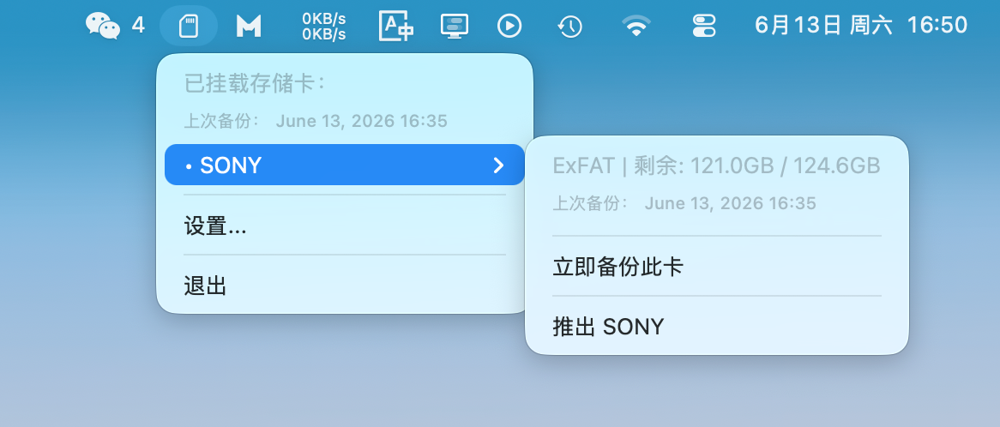
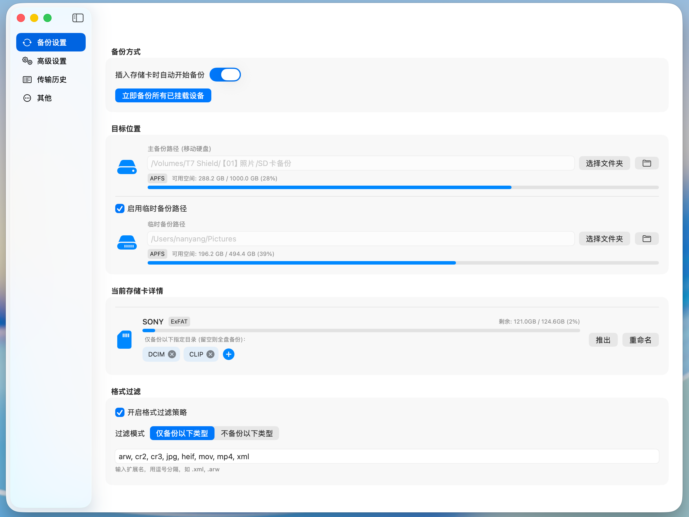
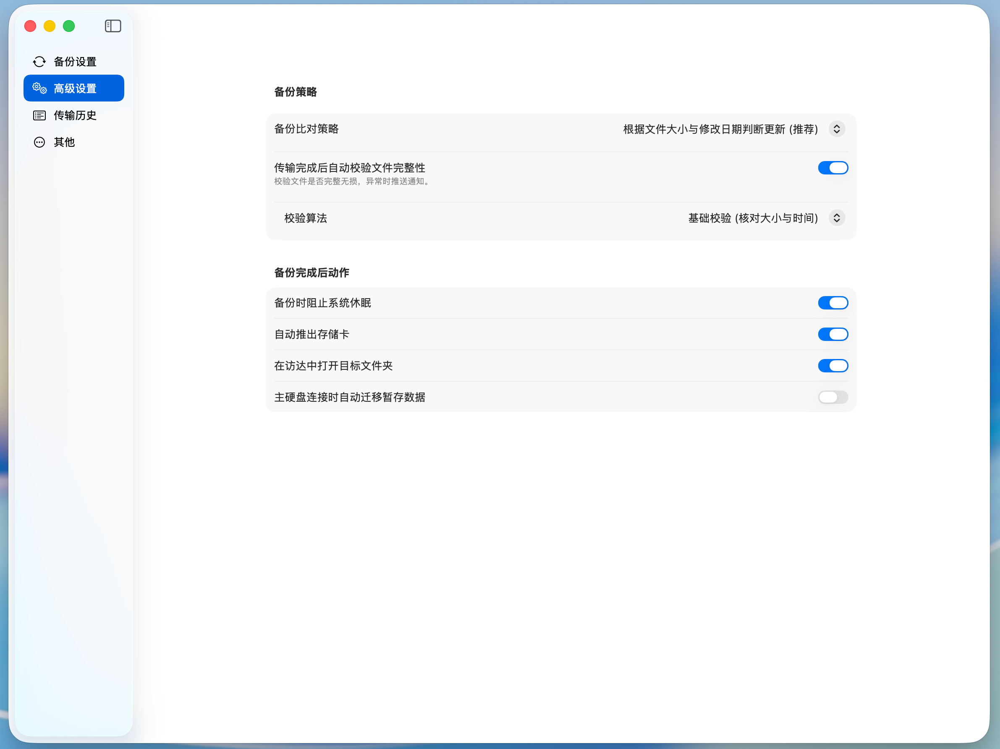
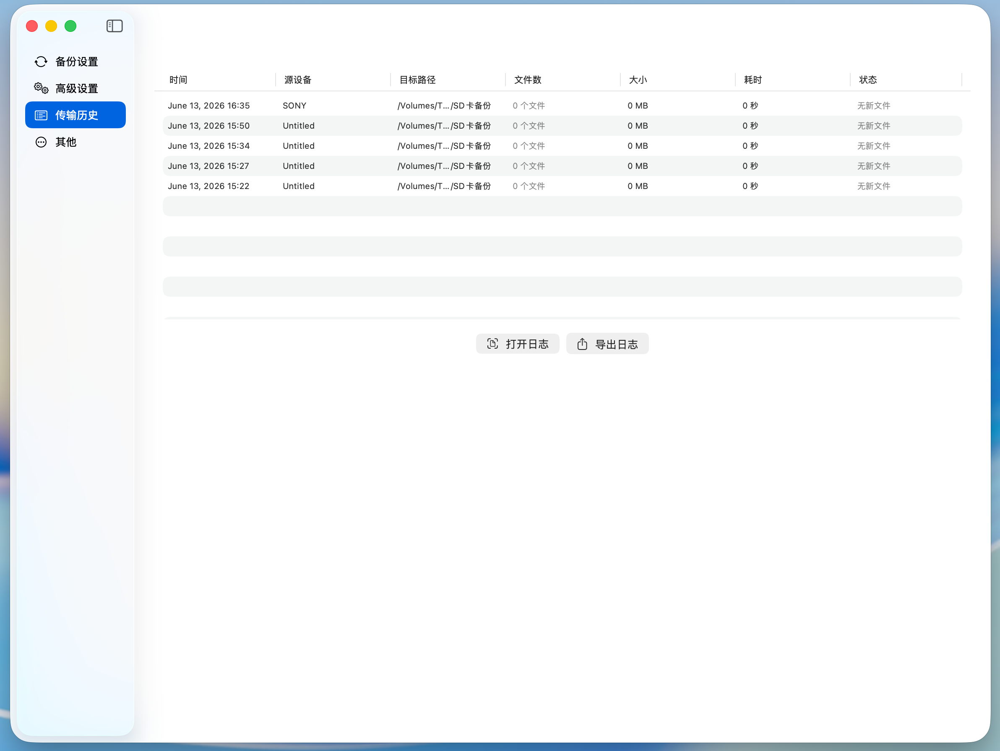
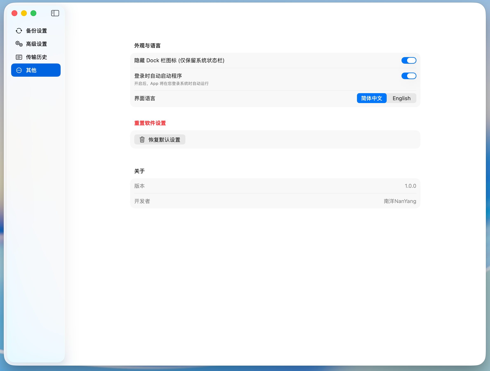

# SDBackup

macOS menu bar application for automatic SD card backup. Designed for photographers and videographers who need reliable, hands-free transfer of photos and videos from camera storage cards to their Mac.

## Features

**Automatic Backup**

Insert an SD card and SDBackup starts copying immediately. No manual action required. Supports multiple cards with a sequential queue -- insert two cards and both will be backed up one after another.

**Multi-Source Directory Selection**

Choose specific folders to back up (DCIM, CLIP, PRIVATE, etc.) or leave empty to back up everything. Each card remembers its own source configuration.

**File Format Filtering**

Filter by file extension in include or exclude mode. Default profile covers common photography formats: ARW, CR2, CR3, JPG, HEIF, MOV, MP4, XML. Skip thumbnails, databases, and other junk files automatically.

**Data Integrity Verification**

Three verification levels:
- Basic: compare file size and modification date
- MD5: hash-based verification after transfer
- SHA256: full cryptographic verification with system notification on corruption

**Backup Strategy**

Two comparison modes:
- Update if modified (default): skip unchanged files, re-transfer modified ones
- Skip existing: never overwrite files already at the destination

**Transfer Estimation**

Before the real transfer begins, a dry run calculates how many files and how many megabytes will be copied, with an estimated completion time.

**Backup Statistics**

Completion notifications break down transferred files by category: photos, videos, metadata, and other. Know exactly what was backed up at a glance.

**Dual Destination with Fallback**

Set a primary backup path (external drive) and an optional local fallback path. If the external drive is not connected, SDBackup writes to the fallback automatically. When the external drive reconnects, cached files are migrated over.

**Card Health Monitoring**

Tracks consecutive IO errors per card. After three failures, SDBackup warns that the card may be failing and should be replaced.

**Crash Recovery**

A lock file prevents concurrent backups to the same destination. A state file tracks transfer progress every 10 files. If the app or system crashes mid-backup, SDBackup detects the stale state on next launch and notifies you.

**Transfer History**

Full log of all backup attempts with timestamp, source device, destination, file count, data size, duration, and status. Export to CSV for record keeping.

**Auto Update Check**

Checks GitHub Releases once per day. If a new version is available, a notice appears in the settings page.

**Launch at Login**

Uses macOS ServiceManagement framework for native login item registration. No third-party dependencies.

**Card Renaming**

Assign custom names to your storage cards for easier identification in the menu bar and settings.

**Dual Language**

Full support for Simplified Chinese and English. Switch instantly from the settings page.

## Screenshots

### Menu Bar

Quick access from the system menu bar. View connected cards, last backup time, and trigger actions without opening the main window.



### Backup Settings

Configure auto-backup, primary and fallback destinations, source directory selection, and file format filtering.



### Advanced Settings

Backup comparison strategy, post-transfer verification, and post-backup actions (prevent sleep, auto-eject, open Finder).



### Transfer History

Review all past backup attempts. Double-click a row to open the destination folder. Export logs to CSV.



### Other Settings

Appearance, language, launch at login, reset, and version info.



## Installation

1. Download `SDBackup-1.0.0.dmg` from [Releases](https://github.com/breaker5474/SDBackup/releases)
2. Open the DMG and drag `SDBackup.app` into your Applications folder
3. Launch SDBackup -- it appears in the menu bar
4. Open Settings to configure your backup destination

## System Requirements

- macOS 13.0 (Ventura) or later
- Apple Silicon or Intel Mac

## Building from Source

```bash
git clone https://github.com/breaker5474/SDBackup.git
cd SDBackup
swift build -c release
```

To build a distributable DMG:

```bash
bash Scripts/build_dmg.sh
```

The DMG will be created at `build/SDBackup-1.0.0.dmg`.

## License

MIT

## Developer

NanYang (南洋NanYang)
